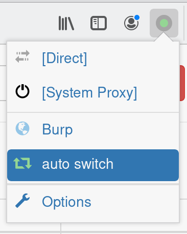
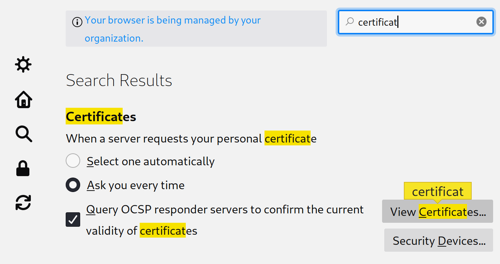

---
title: "Installation Burp"
author: [Olivier LASNE]
date: ""
subject: "Markdown"
keywords: [Burp, Burpsuite, Proxy, SwitchyOmega, installation]
subtitle: "Installer et configurer Burpsuite"
lang: "fr"
titlepage: true
...

# Introduction

Pour tester des applications web, nous utiliserons :

* BurpSuite de PortSwigger (édition Community)
* Firefox ou Chrome
* L'extension Proxy SwitchyOmega

# Burp

Burp le logiciel de référence pour tester des applications web.
C'est un proxy qui va nous permettre d'observer les requêtes et réponses effectuer vers un site web.\
Il contient de nombreux outils qui facilitent le test d'applications web web.

* Une vue proxy pour observer le trafic
* Le repeter qui permet de rejouer des requêtes en les modifiants
* Un décoder pour jongler rapidement entre différents encodages (base64, URL, ...)
* Un scanner dans la version Pro

Burp est disponnible pour Windows, Linux et Mac.

## Télécharger Burp

Le version community est gratuite et contient les outils de base. On peut la télécharger à l'adresse suivante :
__[https://portswigger.net/burp/communitydownload](https://portswigger.net/burp/communitydownload)__

## Installer Burp

Pour l’installer, double-cliquer sur le fichier téléchargé, puis laisser l'option par défaut à chaque étape.

# Firefox

Firefox est un navigateur web développé par la fondation Mozilla. Il s'agit d'un logiciel libre. Vous pouvez télécharger la dernière version à l'adresse suivante :\
__[https://www.mozilla.org/fr/firefox/new/](https://www.mozilla.org/fr/firefox/new/)__

Pour l’installer, double-cliquer sur le fichier téléchargé, puis laisser l'option par défaut à chaque étape.

PS : Vous pouvez également utiliser Google Chrome si vous préférez.

# Proxy SwitchyOmega

Proxy SwitchyOmega est une extension open-source pour Firefox et Chrome, qui permet de rediriger une partie du trafic web vers un proxy.\
Cela va nous permettre de tester notre application web avec Burp, sans être pollué par les requêtes vers les autres sites.

## Installer l'extension

Pour installer l'extension, allez la page suivante avec Firefox :\
__[https://addons.mozilla.org/fr/firefox/addon/switchyomega/](https://addons.mozilla.org/fr/firefox/addon/switchyomega/)__

Et cliquez sur le bouton "Ajouter à Firefox"\
{ width=150px }

Si l'installation se passe correctement, l'icone suivant devrait être ajouté à firefox.
{ height=25px}

## Configurer Proxy SwitchyOmega

En cliquant sur l'icone de SwitchyOmega, le menu suivant devrait apparaitre :

{ width=150px }

Cliquer sur le bouton __Options__.

Le panneau de configuration suivant devrait apparaitre.

### Configurer le proxy

1. Dans le panneau __Profiles__  à gauche, cliquer sur __proxy__.
2. Dans le champ __Server__, mettez la valeur __127.0.0.1__. Laissez la valeur 8080 pour le port.
3. Validez les changement en appuyant sur le bouton __Apply Changes__.

Nous avons maintenant configuré Burp (127.0.0.1 port 8080) en tant que proxy dans l'extension.

### Renommer le proxy

On peut cliquer sur le bouton __rename__ en haut à droite, puis renommer le proxy "__Burp__".

{width=100px}

Le nom de notre proxy devrait changer dans la barre de menu à gauche.

{width=150px}

### Configurer l'auto switch

Cliquer sur l'__auto switch__ dans le menu _Profiles_ à gauche. {height=30px}

L'auto switch permet d'envoyer le trafic de certains site vers notre proxy Burp, et d'utiliser les paramètres du système dans le reste des cas.

À chaque fois que l'on souhaite tester un site web. On peut __ajouter__ son __nom de domaine__ à l'__auto switch__ de façon à __rediriger le trafic__ vers __Burp__.

Dans notre cas, nous allons rediriger vers Burp la plage d'adresses utilisés par le réseau hôte de Virtual Box, et quelques url utilisées par BurpSuite.

Définissez sur les différentes lignes les valeurs suivantes :

* 192.168.56.*
* burp
* burpsuite

En choisissant __Burp__ comme __Profile__.\
__Sauvegarder__ comme précédement en cliquant sur le bouton Apply changes en bas à gauche.

Vous devriez avoir la configuration suivante :

### Utilisation de l'auto switch

Pour utiliser l'auto switch, il suffit de cliquer sur l'icone de SwitchOmega dans la barre de menu de Firefox, et de selectionner __auto switch__.

{width=200px}

Pour rediriger le trafic d'un site suplémentaire, on peut simplement l'ajouter à la liste de l'autoswitch comme vu précédement.

# Installer les certificats de Burp dans Firefox

Pour pouvoir intercepter des communications en HTTPS avec Burp, il est nécessaire d'installer les certificats de Burp dans Firefox.\
Sinon Firefox affichera une erreur disant que la connexion n'est pas sûre. Certains contenus peuvent aussi ne pas être charés par mesure de protection.

## Télécharger le certificat
Pour télécharger le certificat de Burp, effectuer les étapes suivantes :

1. Démarrer Burp.
2. S'assurer que Firefox redirige le trafic vers Burp (SwitchyOmega).
3. Aller à l'adresse __[http://burp/](http://burp/)__
4. Cliquer sur le bouton __CA Certificate__ et télécharger le fichier `cacert.der`.

## Ajouter les certificat de Burp à Firefox
Pour installer le certificat dans Firefox :

1. Dans Firefox, cliquer sur __menu > préférences__.\
{height=250px}
2. Avec barre de recherche, rechercher "certificat".
3. Cliquer sur __Afficher les certificats__ (View Certificates).\
{height=250px}
4. Dans l'onglet __Autorités__, cliquer sur le bouton __Importer__.\
{height=400px}
5. Selectionner le fichier `cacert.der` téléchargé précédement.
6. Lui faire confiance pour tout, et cliquer sur OK.\
{height=300px}

Vous pouvez désormais intercepter des communications en HTTPS avec Burp !

## Erreurs de HSTS

Certains sites utilisent le HSTS, et vont détecter un changement de certificat.\
Dans ce cas vous pouvez ouvrir l'historique, faire un clic droit sur le site, et choisir "Oublier ce site".\
En rechargant la page l'erreur devrait disparaitre.
