---
title: "Mise en place d'un lab avec Kali Linux et Metasploitable 2"
author: [Olivier LASNE]
date: ""
subject: "Markdown"
keywords: [VirtualBox, Kali, Linux, Metasploitable, installation]
subtitle: "Guide d'installation VirtualBox"
lang: "fr"
titlepage: true
...

# Introduction

Pour les travaux pratiques de se cours, nous allons nous entraîner sur des machines virtuelles contenant des vulnérabilités. Nous les attaqueront avec une machine virtuelle Kali Linux.

Le logiciel de virtualisation utilisé ici est __VirtualBox__ qui est open source. La suite VMWare est une alternative commerciale.

Ce document décrit comment __installer Kali Linux, OWSAP Broken Web Apps et Metasploitable 2__ dans Virtualbox. On va configurer un *réseau privé hôte* pour que les machines puissent communiquer.

### Installer Virtualbox

VirtualBox est un logiciel de virtualisation qui va nous permettre d'utiliser Kali Linux dans un environnement isolé, et sans avoir besoin d'un second ordinateur.

Télécharger la version de **Virtualbox** adaptée à votre système d'exploitation (probablement Windows) à l'addresse suivante :
**[https://www.virtualbox.org/wiki/Downloads](https://www.virtualbox.org/wiki/Downloads)**

L'installer de façon classique en double-cliquant sur le **.exe** et en laissant les **options par défaut** à chaque étape.

### Téléchargement de Metasploitable 2 et OWSAP Broken Web Apps

**Metasploitable 2** et **OWSAP Broken Web Apps** sont des machines virtuelles volontairement vulnérables. Vous pouvez les télécharger à l'adresse suivante :

**[https://drive.google.com/drive/folders/1O2U2h_swKD95okCpEqydXKbhNf8R3ttr?usp=sharing](https://drive.google.com/drive/folders/1O2U2h_swKD95okCpEqydXKbhNf8R3ttr?usp=sharing)**

1. Double cliquer sur le fichier
2. Cliquer sur Télécharger
3. Accepter malgré l'absence d'analyse antivirus

### Télécharger Kali Linux

Kali Linux fournit directement des machines virtuelles au format `.ova`.
Vous pouvez la télécharger ici : **[https://www.kali.org/get-kali/#kali-virtual-machines](https://www.kali.org/get-kali/#kali-virtual-machines)**.

Le mot de passe par défaut est __kali / kali__.

### Importer une machine dans VirtualBox

Metasploitable 2 vient ici sous la forme d'une machine virtuelle déjà configurée. Il n'est ici pas nécessaire de réaliser l'installation, on va juste importer le fichier *metasploitable2.ova*.

Dans VirtualBox, utiliser la fonction **Fichier > Importer un appareil virtuel**.

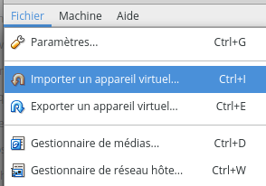{height=200}

Cliquer si l'icone de dossier , et selectionner le fichier *metasploitable2.ova* (dans téléchargement). 

Enusite cliquer sur **suivant** puis **importer**.

La procédure est la même pour __Kali Linux__.

Vous pouvez également installer Kali Linux manuellement si besoin (voir ci-dessous).

\newpage
## Configuration du réseau hôte

### Créer le réseau privé hôte
Un **réseau privée hôte** est un réseau virtuel, qui connecte des machines virtuelles et qui est accessible **uniquement aux machines virtuelles de VirtualBox**, et à la machine faisant tourner VirtualBox.

Après avoir ouvert **VirtualBox**, cliquer sur **Ficher > Gestionnaire de réseau hôte**.
Normalement la configuration suivante est affichée : 

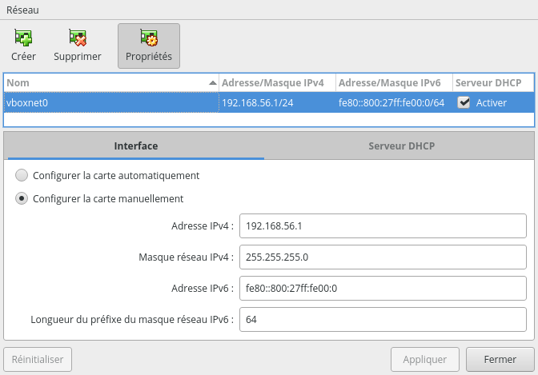

Si il n'y a pas d'interface réseau. Cliquer sur **Créer**, pour créer une nouvelle interface vboxnet0.


## Configurer les interfaces de Kali
Pour **Kali** on garde une interface en **NAT** de façon à pouvoir accéder à Internet, et on créer une **seconde interface** pour le **réseau privé hôte**.


1. Éteindre la machine virutelle Kali.
2. Sélectionner la machine virtuelle dans VirtualBox.
3. Appuyer sur le **bouton configuration** (icone en forme d'engrenage)
4. Dans la barre à gauche cliquer sur **Réseau**
5. Cliquer sur *Interface 2* 
6. Cocher *activer l'interface réseau*.
7. Dans **mode d'accès réseau**, selectionner **Réseau privé hôte**.
8. Dans **nom**, selectionner **vboxnet0**

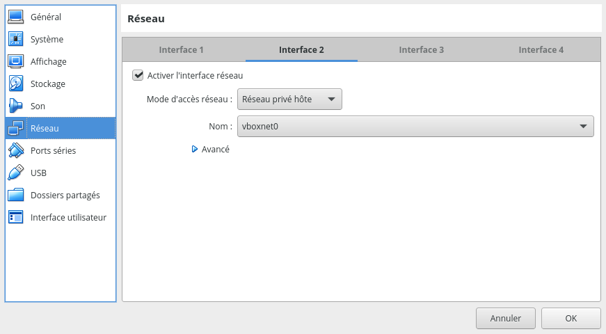

Normalement, nous devrions avoir maintenant deux **interfaces réseau configurées** :

* Une **interface 1** en **NAT**
* Une **interface 2** en **réseau privé hôte**.

## Configurer les interfaces de Metaspoiltable
Faire la même chose sur **Metasploitable**.\
Configurer l'interface réseau 1, et définir le **réseau privé hôte** *vboxnet0*. (Il n'est pas nécessaire de garder une interface en NAT pour accèder à Internet.)

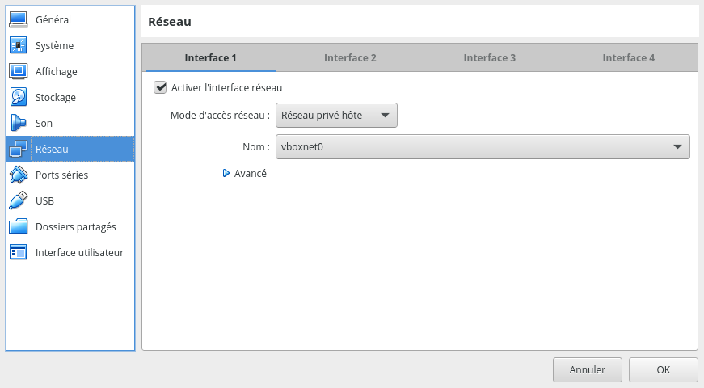

Nous devrions maintenant avoir une seule interface :

* **Interface 1** en **réseau privé hôte**

\newpage


\newpage

## Installation manuelle de Kali Linux

Il est également possible d'installer Kali Linux manuellement depuis un fichier comme n'importe quelle distribution Linux.

### Téléchargement de Kali en fichier .iso

Les fichiers **.iso** sont des fichiers qui imitent un CD. Ce sera ici comme si on utilisait un CD d'installation. Télécharger **Kali Linux 64-Bit (Installer)** à l'adresse suivante :
**[https://www.kali.org/downloads/](https://www.kali.org/downloads/)**

### Configuration VirtualBox

Cliquer sur le bouton **Nouvelle**. 

Donner un nom (ex: Kali), puis choisir type **Linux** et version **debian64**.

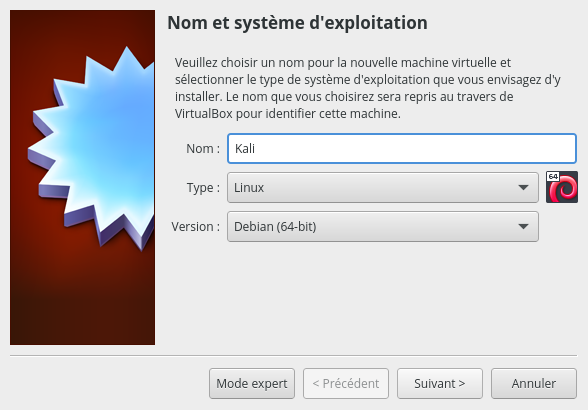

Dans l'option **Taille de mémoire** selectionner **2048**.

Laisser les options par défaut, et à **Emplacement du fichier et taille** choisir **80,00 Gio**.


Ensuite cliquer sur l'icone Configuration. 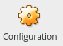

Selectionner **Stockage > *Vide* sous Contrôleur IDE**.

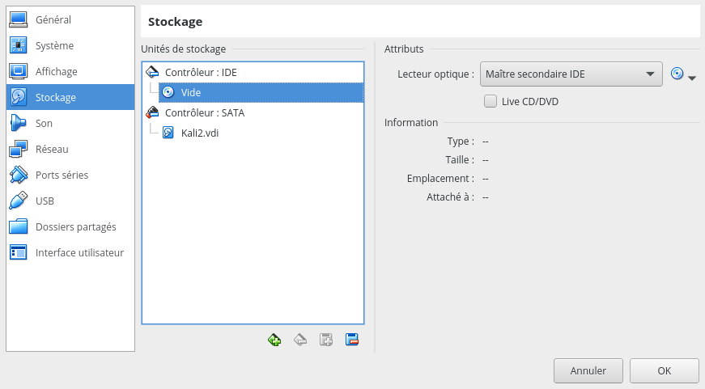

Cliquer sur l'icone de CD {height=20}, et **Choissisez un fichier de disque optique virtuel**. Et selectionner le fichier *kali-linux-2020.4-installer-amd64.iso* téléchagé précédement.

Appuyer sur **OK** en bas à droite pour confirmer les modifications. 

On peut mantenant lancer la machine virtuelle avec le bouton **Démarrer**. .

### Installation de Kali

Au démarrage selectionner **Graphical Install**.

On peut ensuite selectionner **french - français** pour la langue, puis laisser les options par défaut.

Pour le **nom de la machine**, vous pouvez laisser **kali**.

Définisez un **nom d'utilisateur** comme votre prénom ou pseudo, et un mot de passe de votre choix.

Laissez ensuite les options par défaut pour le disque. Et indiquez **Oui** à la page **partitionner les disques**.

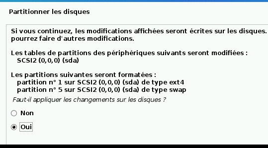

Patientez pendant l'installation. Vous pouvez laisser les paramètre par défaut concernant le choix de logiciels. (L'installation prend environ 1h.)

Pour l'emplacement de **Grub** choisir **/dev/sda**.\
**/!\\ Attention, si vous laisser le choix par défaut à cette étape. La machine démarrera avec un écran noir**

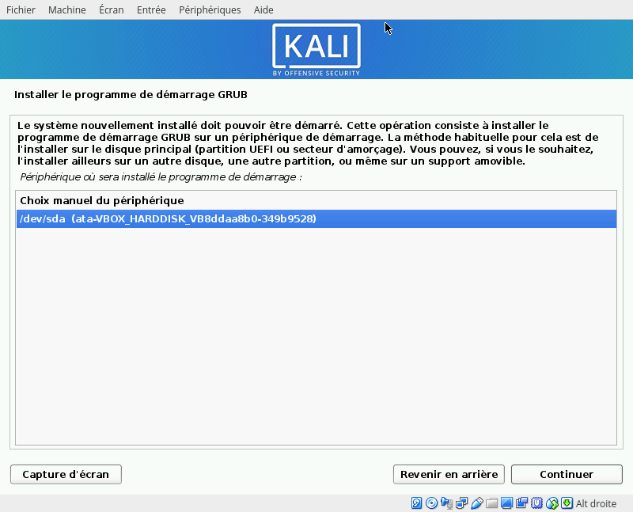

Cliquez ensuite sur **continer** en laissant ensuite les choix par défaut, et le champ texte vide.

Une fois l'**installation terminée**, vous cliquer sur **continuer** pour redémarrer.\
Ensuite vous pouvez vous **connecter** à Kali avec votre **identifiant et mot de passe**.

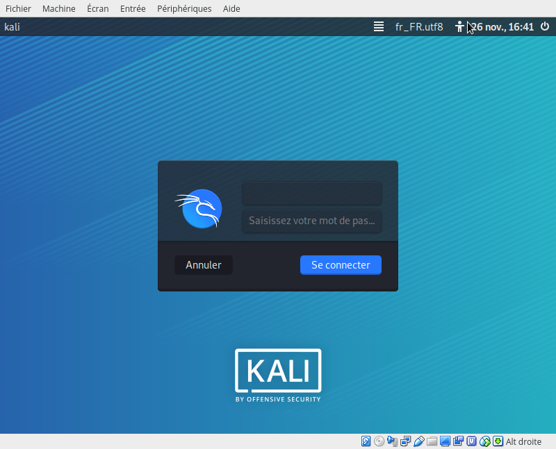

### Permettre le redimensionnement

Par défaut, la taille de l'écran de la machine ne s'adapte pas à celle de la fenêtre de VirtualBox. Il est nécessaire d'installer les **guest-additions** dans Kali pour que ce soit le cas.

Pour les installer, ouvrir un terminal et écrire les commandes suivante :
```sh
sudo apt install virtualbox-guest-dkms
sudo dpkg-reconfigure virtualbox-guest-dkms
```
Puis redémarrer.

Lorsque le noyau Linux est mis à jour, cela à tendance à casser la configuration.\
Si l'écran ne se redimensionne plus, il est alors nécessaire de refaire la commande **`sudo dpkg-reconfigure virtualbox-guest-dkms`**, et de redémarrer la machine virtuelle.

\newpage

# Erreurs communes VirtualBox

## Erreur USB au démarrage
Il est fréquent qu'une machine virtuelle n'arrive pas à démarrer cause d'une configuration du contrôleur USB.

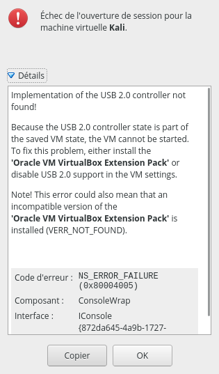{height=500}

Dans ce cas, changer le contrôleur dans les paramètres USB de la machine virtuelle.

1. Cliquer une fois sur la machine virtuelle.
2. Appuyer sur le **bouton configuration** (icone en forme d'engrenage)
3. Dans la barre à gauche cliquer sur **USB**
4. Selectionner **Contrôleur USB 1.1 (OHCI)**

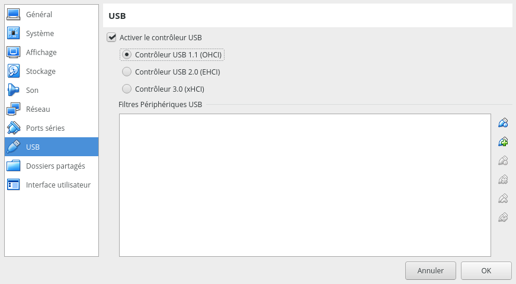
